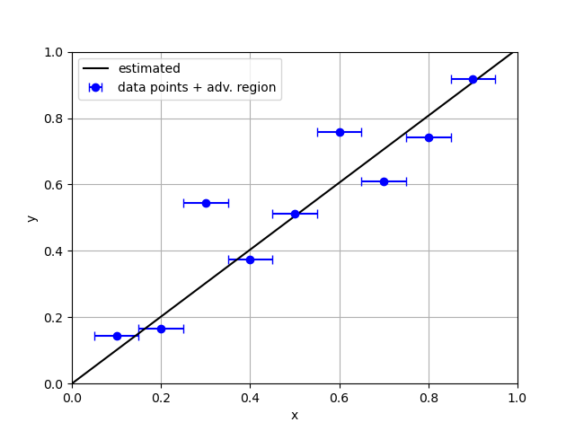
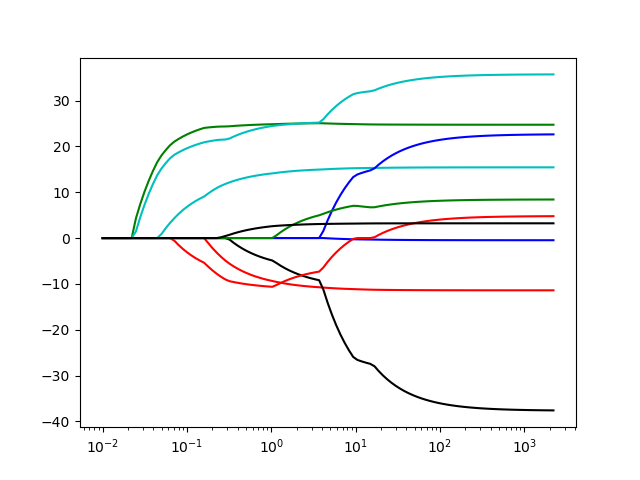
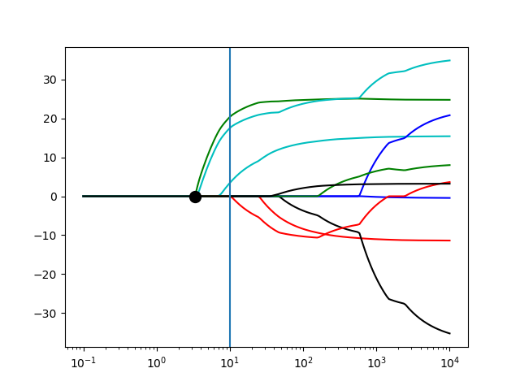
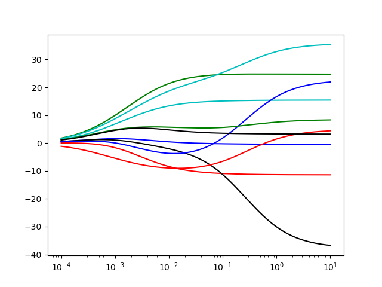
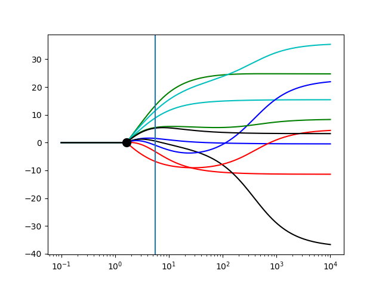
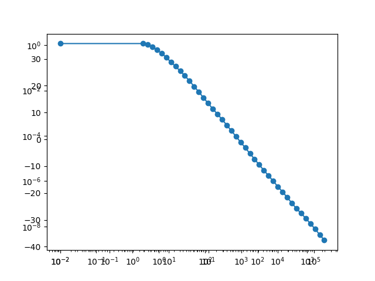
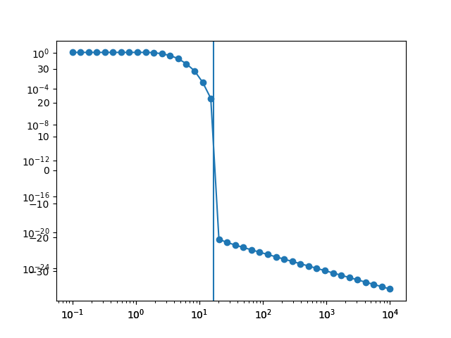
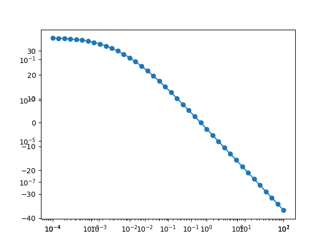
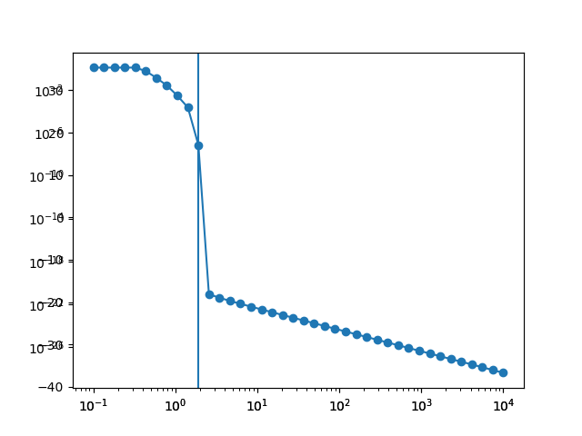

# Adversarial training in linear models

[](https://opensource.org/licenses/MIT)

This library solves linear regression models. It find the parameter $\hat \beta$ of a linear model, 
such that given an input $x$ and it produces the prediction.
$$\hat{y} = \hat\beta^\top x.$$


This library solves the regression problem (estimating the parameter $\hat\beta$) using adversarial training.
The idea is to make the model robust by optimizing in the presence of disturbances.
It considers training inputs have been contaminated with disturbances deliberately 
chosen to maximize the model error.

Given pair of input-output samples $(x_i, y_i), i = 1, \dots, n$, it is formulated as a min-max optimization problem:

$$\min_\beta \frac{1}{n} \sum_{i=1}^n \max_{||\Delta x_i|| \le \delta} (y_i - \beta^\top(x_i+ \Delta x_i))^2$$

## Usage
### One dimensional example

```python
from linadvtrain.regression import lin_advregr
import numpy as np

# Generate dataset
rng = np.random.RandomState(5)
X = np.array([0.1, 0.2, 0.3, 0.4, 0.5, 0.6, 0.7, 0.8, 0.9])[:, None]
noise = 0.15 * rng.randn(len(x))
y = x + noise

# Adversarial estimation
adv_radius = 0.05
estimated_params, info = lin_advregr(X, y, adv_radius=adv_radius)
```

The image ilustrate the adversarial training the output of the example above, with the adversarial radius
being highlighted as error bars.  See [examples/one_dimensional.py](examples/one_dimensional.py) for more details.




### Multi-dimensional example
Bellow we illustrate one example using diabetes dataset. When `p = 2` we are computing the $\ell_2$ adversarial training,
and when `p = np.inf` we are computing the $\ell_\infty$ adversarial training. Since adv_radius is not set,
the default value is used.

```python
import numpy as np
from linadvtrain.regression import lin_advregr
from sklearn import datasets

X, y = datasets.load_diabetes(return_X_y=True)
# Standardize data
X -= X.mean(axis=0)
X /= X.std(axis=0)

# Compute l2adversarial training
estim_param, info = lin_advregr(X, y, p=2)

# Compute linf adversarial training
estim_param, info = lin_advregr(X, y, p=np.inf)
```


# Properties of adversarial training

### Similarities with Lasso and Ridge regression
$\ell_\infty$ adversarial training has similarities with Lasso. $\ell_2$ adversarial training has similarities with
ridge regression. See [examples/diabetes_path.py](examples/diabetes_path.py) for more details.

|  Lasso | Adv. training $\ell_\infty$ | 
| :---: | :---: |
|  | | 

| Ridge | Adv. training $\ell_2$ |
| :---: | :---: |
|  |  |

### Relation to minimum norm solution
For small delta adversarial training interpolates the training data. 
See [examples/transition_into_interpolation.py](examples/transition_into_interpolation.py) for more details.


|  Lasso | Adv. training $\ell_\infty$ | 
| :---: | :---: |
|  | | 

| Ridge | Adv. training $\ell_2$ |
| :---: | :---: |
|  |  |

